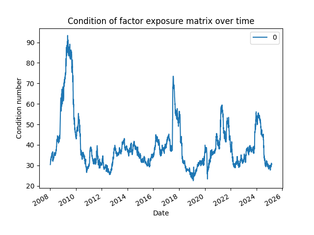
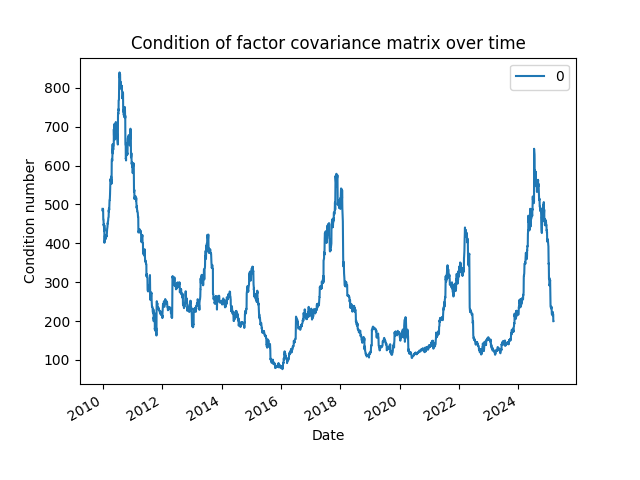
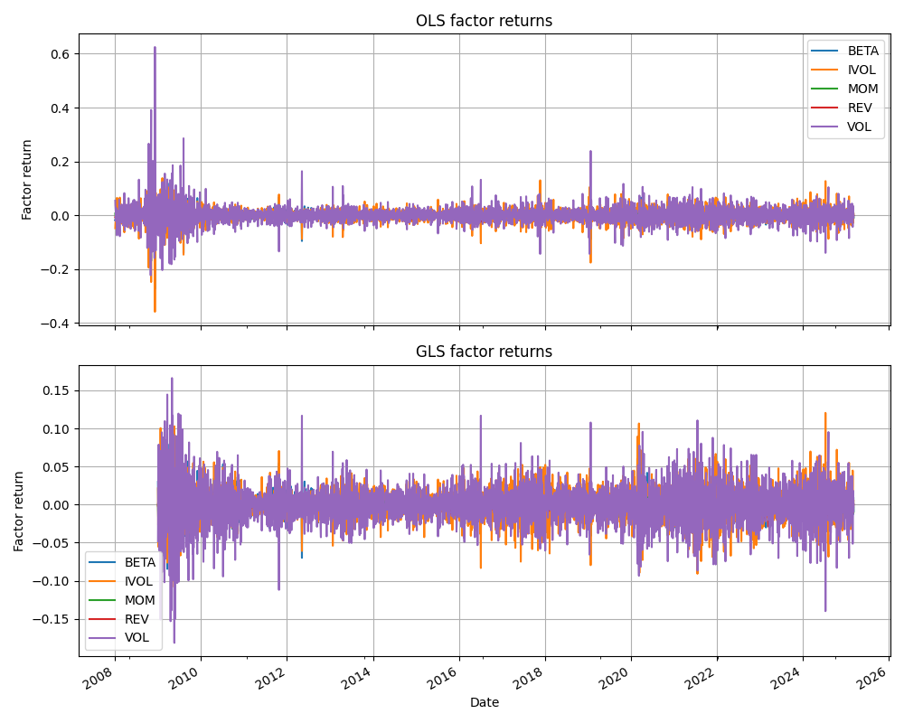
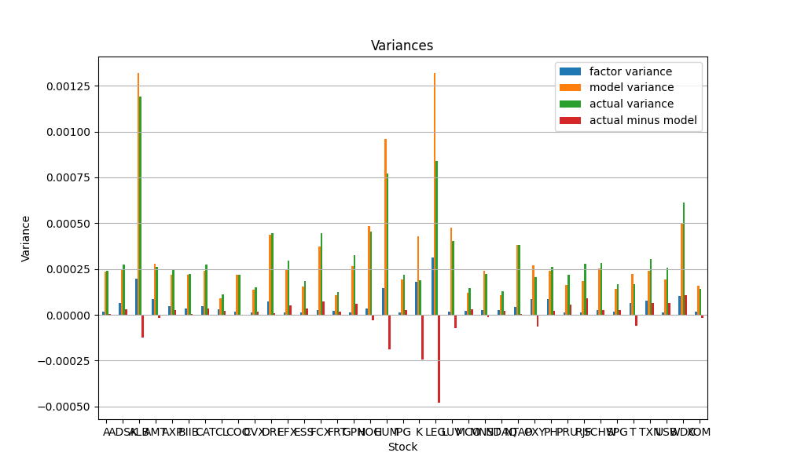

# time-series-modelling
This repository contains an implementation of the model described in the first two parts of "Active Portfolio Management" by Grinold and Kahn. It exists because I want to teach myself about quantitative modelling and time series analysis. The goal is to implement the risk model using freely available stock price data from `yfinance` and produce a back-tested portfolio whose performance can be compared against a benchmark. The idea is to understand how the model works in theory and in practice, not to actually find new alpha and achieve maximum performance. 

## Overview

The core logic is implemented in a single file (`core.py`) which contains some sanity-check tests. These need to be made into actual tests and moved into their own file. A more detailed
mathematical description of what exactly is being implemented is provided in `notes.pdf`. This is also incomplete.

## Project Structure

- `core.py` – core algorithms and computations
- `SP500.csv` - list of S&P 500 tickers from [here](https://gist.github.com/ZeccaLehn/f6a2613b24c393821f81c0c1d23d4192)
- `notes.pdf` – mathematical descriptions of the model and rationale for implementation decisions
-  The code creates `.pkl` files to cache data in order to avoid repetitive redownloading and recomputing every time it's run.

## Status

This project is under active development. 


## Usage

The script (`core.py`) runs the entire pipeline when executed.

To run:
```bash
python core.py 
```

## Notes

The emphasis is on correctness and clarity (to support my conceptual understanding) rather than performance, although it runs just fine on an m1 macbook.

## Selected Outputs

### Condition number of the factor exposure matrix
The illiquidity factor is dropped and the remaining five factors are used to generate all subsequent plots. Including this factor significantly increases the condition number plotted below.



### Condition number of the factor covariance matrix



### OLS vs GLS factor returns



Mean and median residual return variance for OLS factor returns are 0.8873 and 0.9040 respectively. For GLS factor returns the corresponding figures are 0.8271 and 0.8244 respectively. This indicates that GLS factors capture a bit more of the variance in returns, as expected.

### Factor vs model vs actual variances


Factors alone explain only a small portion of the variances of the returns. Adding the idiosyncratic variances results in a much better match with the actual historical variances of the returns. This is plotted for selected securities above.
